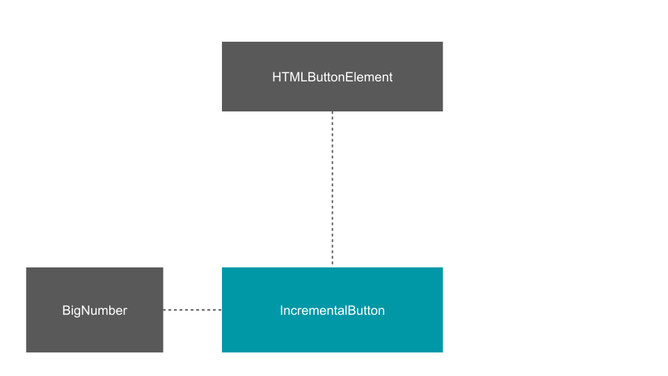
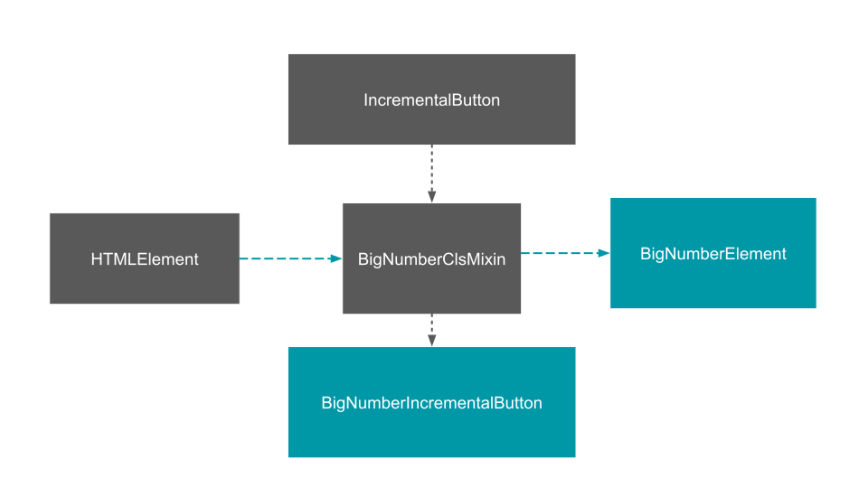

# Composition

[Composition](https://en.wikipedia.org/wiki/Composition_over_inheritance) is one of the powerful techniques in OOP. 

## Include in the project
```javascript
import {mix} from "./node_modules/zsui-core/src/smart/mixin.m.js";
```

## Quick example

```javascript
var a = {
	foo() {return 2;}
}

mix(a, {
	bar: 1
});

console.log(a.foo(), a.bar);	// 2 1
```
We can mix as many object as we like

```javascript
mix({a:1}, {b:2}, {c:3});	// {a:1, b:2, c:3}
```

We can mix setters and getters.

```javascript
var a = mix(
	{
		get bar() {return this._bar;}
	},
	{
		set bar(newValue) {
			this._bar = newValue;
		}
	};
);
```


## Composition to create components

Imagine we have several features we can use in many cases. Like display big numbers. And we want to add such a feature to another element like a button.



```javascript
// Display big numbers
class BigNumberCls {
	
	get value() {
		return this._value || 0;
	}
	set value(newValue) {
		this._value = newValue;
	}
	get suffixes() {return ["", "k", "m", "b","t"]}
	valueOf() {
		return this._value;
	}
	toString(value) {
		value  = value || this.value;
		if (value >= 1000) {
			var suffixes = this.suffixes;
			var suffixNum = Math.floor( (""+value).length/3 );
			var shortValue = '';
			for (var precision = 2; precision >= 1; precision--) {
				shortValue = parseFloat( (suffixNum != 0 ? (value / Math.pow(1000,suffixNum) ) : value).toPrecision(precision));
				var dotLessShortValue = (shortValue + '').replace(/[^a-zA-Z 0-9]+/g,'');
				if (dotLessShortValue.length <= 2) { break; }
			}
			if (shortValue % 1 != 0)  shortValue = shortValue.toFixed(1);
			return  shortValue+suffixes[suffixNum];
		}
		return value.toString();
	}
}

// Incremental button
class IncrementalButton extends HTMLButtonElement {
	constructor() {
		super();
	}
	increment(amount) {
		this.value = (Number(this.value) || 0) + amount; 
	}
	connectedCallback() {
		this.addEventListener('click', function(event) {
			this.increment(1000);
			this.innerHTML = this.toString ? this.toString(this.value) : this.value

		});
	}
}

// Apply composition
mix(IncrementalButton.prototype, BigNumberCls.prototype);

// Define custom Element
customElements.define('inc-button', IncrementalButton, {extends: 'button'});

// Create a button and append it to the DOM
var incBtn = document.createElement('button', {is: 'inc-button'});
incBtn.innerHTML = 'Click me';
document.body.appendChild(incBtn);
```

## Functional composition to create components

We can use another approach to enhance our `IcrementalButton` from the  example above by using a [functional composition](https://en.wikipedia.org/wiki/Function_composition_(computer_science)).



```javascript
// Functional mixin of a BigNumber class
function BigNumberClsMixin(Base) {
	return class BigNumberCls extends Base {
		get value() {
			return this._value || 0;
		}
		set value(newValue) {
			this._value = newValue;
		}
		get suffixes() {return ["", "k", "m", "b","t"]}
		
		valueOf() {
			return this._value;
		}
		toString(value) {
			value  = value || this.value;
			if (value >= 1000) {
				var suffixes = this.suffixes;
				var suffixNum = Math.floor( (""+value).length/3 );
				var shortValue = '';
				for (var precision = 2; precision >= 1; precision--) {
					shortValue = parseFloat( (suffixNum != 0 ? (value / Math.pow(1000,suffixNum) ) : value).toPrecision(precision));
					var dotLessShortValue = (shortValue + '').replace(/[^a-zA-Z 0-9]+/g,'');
					if (dotLessShortValue.length <= 2) { break; }
				}
				if (shortValue % 1 != 0)  shortValue = shortValue.toFixed(1);
				return  shortValue+suffixes[suffixNum];
			}
			return value.toString();
		}
	}
}

// Define another custom button but with using functional composition
customElements.define('inc-mix-button', BigNumberClsMixin(IncrementalButton), {extends: 'button'});

// Create a button and append it to the DOM
var incMixBtn = document.createElement('button', {is: 'inc-mix-button'});
incMixBtn.innerHTML = 'Click me';
incMixBtn.classList.add('zs-button');
document.body.appendChild(incMixBtn);
```

