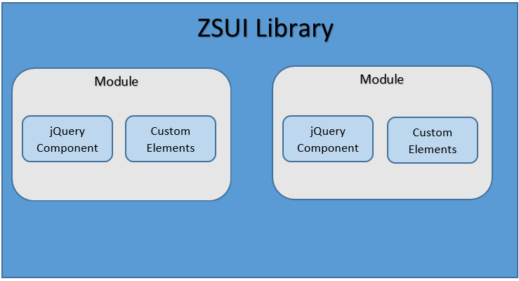

## ZSUI Components



>  The main aim of this tutorial to give you an overview about the library compoenents. If you have not already, please go through the [structure](./structure.md) of the library to understand this tutorial better. As of now, we have jQuery components as well as custom elements components in the library. Let us first understand about how we can make components using jQuery and custom elements respectively.

### jQuery

You probably have heard about jQuery. Maybe it is the most popular JavaScript library in it’s entire history.

Official [website](https://jquery.com/) describes it as follows: “jQuery is a fast, small, and feature-rich JavaScript library. It makes things like HTML document traversal and manipulation, event handling, animation, and Ajax much simpler with an easy-to-use API that works across a multitude of browsers. With a combination of versatility and extensibility, jQuery has changed the way that millions of people write JavaScript.” 

Here we assume that you are familiar with basics of jQuery. Otherwise please help yourself with this [quick start](https://learn.jquery.com/about-jquery/).

When we speak about jQuery it is impossible to ignore plugins. jQuery plugins ecosystem has built frontend web development we know today. Wise combination of plugins can make your web app work perfectly with minimum effort. Basically, only one thing you need to do in order to create jquery plugin:

```
    //creating plugin myPlugin

    $.fn.myPlugin = function(){
        
        //write your code...

    }

    $('div').myPlugin(); //using myPlugin
```
You simply need to create a function and add it to jQuery object namespace. After that you are free to use it as regular jQuery method like each(), css(), addClass() etc.

jQuery plugin is a great way to create resuable components but we are more inclined towards creating components using custom elements rather than using jQuery plugins. The reason is simple: Why to use third party application when we native support to create a resuable component? Now let's go through an overview of custom elements:

### Custom Elements

Custom elements allow you to extend HTML and define your own tags. Custom Elements provide us a native solution to create resuable components. They are a part of standard browser API and that means you need nothing special to use them in browser that supports them. It is one of the key features of the Web Components that encapsulate your functionality on an HTML page, rather than having to make do with a long, nested batch of elements that together provide a custom page feature. Following example will show how to create a simple custom element:

The controller of custom elements on a web document is the CustomElementRegistry object — this object allows you to register a custom element on the page, return information on what custom elements are registered, etc.

We can define a custom `my-component` element like:

`customElements.define('my-component', MyComponent, { extends: 'p' });`

In above example, the element is `my-component`, its class object is `MyComponent` and it extends `<p>` element which is optional.

The custom element's class can be written as:

```
    class MyComponent extends HTMLParagraphElement {
        constructor() {
        super();

        // Element functionality written in here

        ...
        }
    }

```

This is just a simple example, but there is more you can do here. It is possible to define specific [lifecycle callbacks](https://developer.mozilla.org/en-US/docs/Web/Web_Components/Using_custom_elements#Using_the_lifecycle_callbacks) inside the class, which run at specific points in the element's lifecycle. 

Now you can simply use `<my-component>` or `document.createElement('my-component')` in your page if your element doesn't inherit from any standard HTML elements. This is called `Autonomous custom elements`.

And if your element inherits from any HTML element like in above example you can use `<p is="my-component">` or `document.createElement("p", { is: "my-component" })` and these are called `Customized built-in elements`.

Well, that looks good but we were ignoring one huge problem so far: browser support. This thing is a real nightmare for web developers all the times. But what about Custom Elements? What’s about their support? So you don't need to worry about this, ZSUI Library is a great solution in this case. It contains several light-weight polyfills that make it possible to use Custom elements in different browsers.

### ZSUI Components

If you have gone through the library [structure tutorial](./structure), then already know that the ZSUI library is modular. Each module contains bunch of resuable components that you can use in your applications to save time in solving business cases. Take a look at the list of ZSUI modules with their components:

*Click each module name to go through the details of each component*


* [Core](https://bitbucket.org/zssd/zsui-core/src/67a31b8e9493acba7d26c01e29a8d877200d2a3b/docs/index.md)
    
    * Animation	
    * Custom Elements	
    * Highlight	
    * Loading	
    * Dom Helper	
    * Configuration	
    * ...

* Layout

    * Header
    * Tabs
    * Wizard
    * Toggle tabs
    * Cards
    * Accordion
    * Drawer
    * ...
   
* Nav

    * Pagination
    * Breadcrumbs
    * Tree
    * ...

* Forms

    * Clear
    * Datepicker
    * Timepicker
    * Searchable Dropdown
    * Filter
    * Choice
    * Progress Bar
    * Slider
    * Toggle
    * Tags
    * ...

* Tables

    * Table components
    * Editable table
    * Delayed render
    * Smart render
    * Sorting
    * Pivot table
    * Locked columns
    * Sticky header
    * ...

* Flow

    * Flow Chart
    * Tree Chart
    * Node Connector
    * ...

* Dialog

* Messaging

* App


