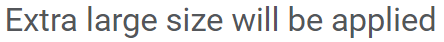
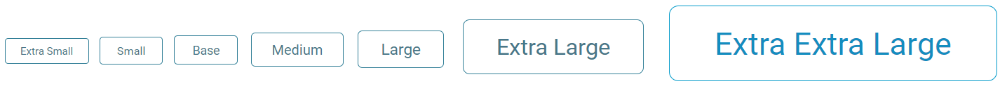
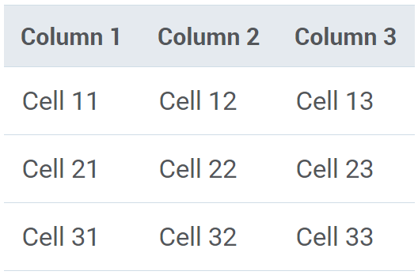

# Size and Space 

In ZSUI library we have several distinctive features. How we deal with size and space is one of them. 

In short...

 * We use `border-box` for `box-sizing` of all elements.
 * We have a special `relative box model`.
 * We have `size modes`. :new:


## Box model

All HTML elements can be considered as boxes. Those boxes consist of margins, borders, padding, and some content. Such a model is known as [`CSS Box Model`](https://developer.mozilla.org/en-US/docs/Web/CSS/CSS_Box_Model/Introduction_to_the_CSS_box_model) or simply `box model`.

.png)

>  Very important question is what is the size of the element itself? Is it only content size or paddings/margins/borders included? 

By default box model sets the size of an element equals to the size of the content. But if you change element’s [`box-sizing`](https://developer.mozilla.org/en-US/docs/Web/CSS/box-sizing) CSS property to **border-box**, it will now include paddings and borders too. 

This is very handy when building UI components and many popular libraries like [Bootstrap](https://blog.getbootstrap.com/2013/08/19/bootstrap-3-released/) use **border-box** by default for `box-sizing` property of the box model. 

Try [this example](https://mdn.mozillademos.org/en-US/docs/Web/CSS/box-sizing$samples/Example?revision=1395055) to see the difference.

```CSS
div {
  width: 160px;
  height: 80px;
  padding: 20px;
  border: 8px solid red;
  background: yellow;
}

.content-box { 
  box-sizing: content-box; 
}

.border-box { 
  box-sizing: border-box;
}
```

```HTML
<div class="content-box">Content box</div>
<br>
<div class="border-box">Border box</div>
```

>  ZSUI library is using **border-box** by default to drive the size of all elements.


## Relative box model

CSS has different [units]((https://developer.mozilla.org/en-US/docs/Learn/CSS/Introduction_to_CSS/Values_and_units)) for expressing length. Probably, the most popular three includes: 
 *	`px` - absolute unit, equals 1 pixel
 *	`%` – relative unit, measures percent of the parent’s size
 * `em` - relative to the font-size of the element
 
We can set width and height, padding and margin, of an HTML element based on its font size. Basically, using `em`.

```HTML
<div style="width:3em;height:3em;border:1px solid red">Me</div>
```
Now, such an element will nicely adjust its size when you increase or decrease the font size of the element itself or its container.

We call it `Relative box mode`. Check it out in [one](https://ui.zsservices.com/demo/zsui/box.html) of our examples.


## Size Modes

We have following seven different size modes in the library with their respective font-sizes: 

* Extra Small (xs) : 12px
* Small (s) : 13px
* Regular (r) : 14px
* Medium (m) : 16px
* Large (l) : 18px
* Extra Large (xl) : 26px
* Extra Extra Large (xxl) : 36px

And to support these sizes, we have introduced following classes:

* zs-size-extra-small and zs-size-xs for Extra Small size
* zs-size-small and zs-size-s for Small size
* zs-size-regular and zs-size-r for Regular size  
* zs-size-medium and zs-size-m for Medium size
* zs-size-large and zs-size-l for Large size
* zs-size-extra-large and zs-size-xl for Extra large size
* zs-size-extra-extra-large and zs-size-xxl for Extra Extra large size

Add above classes as required in the element to get the desired size as:

### Text



```HTML
<p class="zs-size-xl">Extra large size will be applied</p>
```


### Icons


```HTML
<span class="zs-icon zs-icon-delete zs-size-xs"></span>
<span class="zs-icon zs-icon-delete zs-size-s"></span>
<span class="zs-icon zs-icon-delete zs-size-r"></span>
<span class="zs-icon zs-icon-delete zs-size-m"></span>
<span class="zs-icon zs-icon-delete zs-size-l"></span>
<span class="zs-icon zs-icon-delete zs-size-xl"></span>
<span class="zs-icon zs-icon-delete zs-size-xxl"></span>  
```
>  With the magic of ZSUI library's relative box model, these sizes can also be used in libarary components to change their sizes and will apply required box model properties as required: 

### Buttons



```HTML
<button class="zs-button zs-size-xs">Extra Small</button>
<button class="zs-button zs-size-s">Small</button>
<button class="zs-button zs-size-r">Base</button>
<button class="zs-button zs-size-m">Medium</button>
<button class="zs-button zs-size-l">Large</button>
<button class="zs-button zs-size-xl">Extra Large</button>
<button class="zs-button zs-size-xxl">Extra Extra Large</button>  
```

### Table



```HTML
<table class="zs-data-table zs-size-xl">
    <thead>
        <tr>
            <th>Column 1</th>
            <th>Column 2</th>
            <th>Column 3</th>
        </tr>
    </thead>
    <tbody>
        <tr>
            <td>Cell 11</td>
            <td>Cell 12</td>
            <td>Cell 13</td>
            
        </tr>
        <tr>
            <td>Cell 21</td>
            <td>Cell 22</td>
            <td>Cell 23</td>
    
        </tr>
        <tr>
            <td>Cell 31</td>
            <td>Cell 32</td>
            <td>Cell 33</td>
          
        </tr>
    </tbody>
</table>  
```


