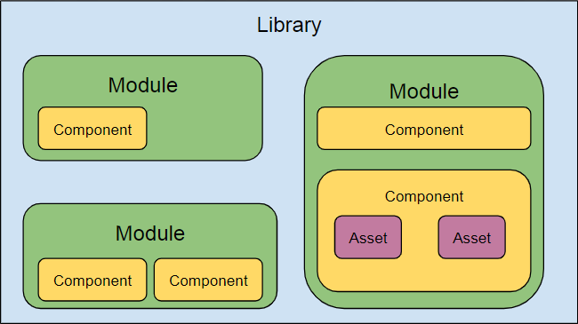

# Structure of the library 

>  In UI architecture team we try to make the library scalable so we won't need to change the structure for many years ahead. It reduces the maintenance costs when teams can install modules, components and assets they really need.

ZSUI library is modular. Each module has a dedicated repository.

## Primary modules

 * [zsui-core](https://bitbucket.org/zssd/zsui-core)
 * [zsui-layout](https://bitbucket.org/zssd/zsui-layout)
 * [zsui-nav](https://bitbucket.org/zssd/zsui-nav)
 * [zsui-forms](https://bitbucket.org/zssd/zsui-forms)
 * [zsui-tables](https://bitbucket.org/zssd/zsui-tables)

## Secondary modules
 * [zsui-auth](https://bitbucket.org/zssd/zsui-auth)
 * [zsui-dialog](https://bitbucket.org/zssd/zsui-dialog)
 * [zsui-message](https://bitbucket.org/zssd/zsui-message)
 * [zsui-app](https://bitbucket.org/zssd/zsui-app)
 * [zsui-flow](https://bitbucket.org/zssd/zsui-flow)
 * ...

# File structure of the module 

A module of the library will supply your project with one or several components. Each component provides features or assets for your  applications. Let�s take a closer look at `zsui-core` module structure.

* `zsui-core`
  * `dist`    *-production code*
	* `animation`
	* `fonts`
	* `images`
	* `loading`
	* `highlight`
	* `tooltip`
	* `utils`	
	* animation.html	*-examples*
	* box.html
  * `tutorials`
	* intro.md  *-tutorials*
	* *...*	
  * `src`	 *-source code*
    * `animation`
	* `fonts`
	* `images`
	* `less`
  	* `themes`
  	* `tooltip`  *- component's source*
	  * test.tooltip.js	*- unit test*
	  * tooltip.less *- source for styles*
	  * tooltip.mjs	*- js source*
  	* `utils`
  * `demo` *- templates for examples*
    

We separate sources and consumables for every component. This way you have more control and flexibility to use production code from the library or prepare the code for production from the source.

A typical component of the library provides one or several re-usable UI `assets`. Which can be delivered as one or many files of different types HTML, CSS, Javascript, WOFF2, PNG, etc... 

Every UI control is an asset but images, web fonts, utilities are assets too.

Additionally, we have examples, tutorials and documentation in the repository to assist developers.

>   ZSUI library is structured the way it could be assembled from many modules in a single folder in your project `dist/zsui` and files won't collide with each other. We often call such an assembly a `distributive` of the library.

# NPM package structure

Library modules are distributed as packages through our [SD feed](./connect.md). You can install them in your project using NPM or Nuget.

Let's checkout the file structure of the `zsui-core` module after installing it via `npm install zsui-core`.

* `node_modules`
	* ... 
	* `zsui-core`
		* `demo` *-source and templates for examples*
		* `dist` *-production code with examples*
			* `animation`
			* `fonts`
			* `images`
			* `loading`
			* `highlight`
			* `tooltip`
			* `utils`	
			* animation.html	*-examples*
			* box.html
		* `src`
			* `animation`
			* `fonts`
			* `images`
			* `less`
			* `themes`
			* `tooltip`  *- component's source*
		* Gruntfile.js *- automation scripts*
		* package.json *- package description*
		* setup.js	*- setup script*

As you can see, this package structure reflects the original repository file structure excluding `tutorials` and `documentation`.

# Nuget package structure

We have a slightly different file structure for the nuget package and where it is installed in a VS solution.

* `Solution folder`
	* `packages`
    	* `zsui-core-x.x.x`
			* `Content`
			* `demo`
			* `docs`
			* `src` *- source code*
				* `animation`
				* `fonts`
				* `images`
				* `less`
				* `themes`
				* `tooltip`  
	* `Project folder`
		* `zsui` *-production code with examples*
			* `animation` 
			* `fonts`
			* `images`
			* `loading`
			* `highlight`
			* `tooltip`
			* `utils`	
			* animation.html	*-examples*
			* box.html	
