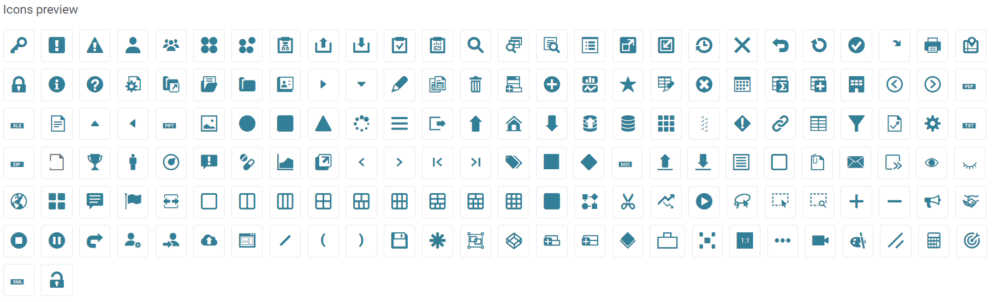
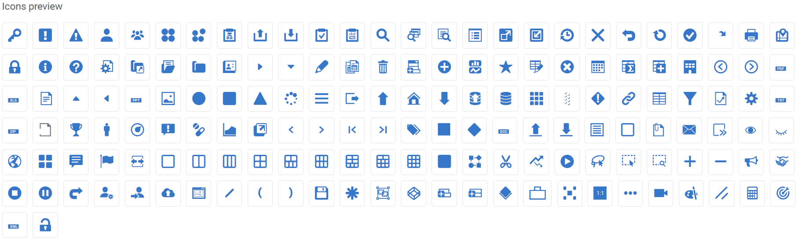
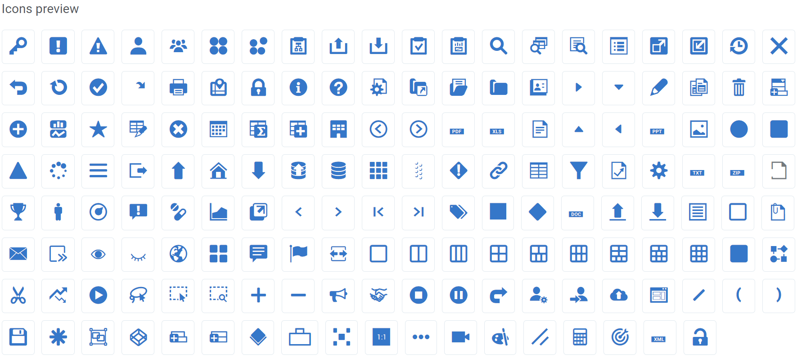
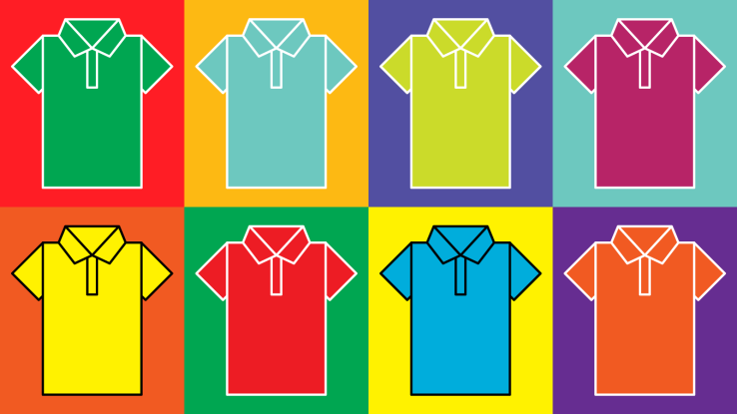

## Less Overview

>  Less is a CSS pre-processor, meaning that it extends the CSS language, adding features that allow variables, mixins, functions and many other techniques that allow you to make CSS that is more maintainable, themeable and extendable : [LessCss.org](http://lesscss.org/)

In other words, LESS is dedicated to improve CSS, adding features it doesn't have at the moment: variables to store frequently used styles, functions for common features, mixins and a lot of other helpful tools.

LESS itself isn’t interpreted by browser. We have to go through 3 particular steps in order to use LESS in a browser:

`Write LESS code --> Compile it to plain CSS --> Add this CSS to your HTML.`

To compile LESS you need installed compiler. Don’t forget that it requires [`Node.js and NPM`](https://nodejs.org/en/download/). 

Install LESS NPM package:

`npm install less`

And use it to compile your .less file into .css file.

`lessc styles.less style.css`

Some important features of less to look out for:

* [Less Variables](http://lesscss.org/features/#variables-feature) : This is one of the most powerful features of LESS. Variables allow you to define styles once and use them several times. Also you may use arithmetical operations with variables: +, -, *, /. This allows you to be more flexible in your code and improve its readability. 

* [Less Functions](http://lesscss.org/functions/) : LESS provides different useful functions. Function is a pre-defined code for some purpose available in LESS. For instance, if you require color that lighter than some other color, you might find `lighten()` function quite useful.

* [Less Mixins](http://lesscss.org/features/#mixins-feature) : This construction allows you to avoid code duplication (which is unfortunately quite common issue for CSS). You may think about LESS mixins like about procedures. Some styles can be defined ones and use several times in the code. Plus you have the additional flexibility in customization. 

* LESS had much more interesting stuff to observe: [import](http://lesscss.org/features/#import-atrules-feature), [loops](http://lesscss.org/features/#mixins-feature-loops-feature), [parent selector](http://lesscss.org/features/#parent-selectors-feature) and many more. 

## ZSUI Library Themes

ZSUI Library supports themes. Basically it means, that you can choose different variations in colors, fonts, etc for your project. 
At the moment, Library contained 3 pre-built themes: zs, blue and blueLarge. You can change current theme of your app simply by changing path to css file. 

* zs theme [example](https://ui.zsservices.com/stage/zsui/icons.html)

```

    <!DOCTYPE html>
    <html lang="en">
    <head>
        <title>ZSUI DEmo</title>
        <meta http-equiv="X-UA-Compatible" content="IE=edge">
        <meta name="viewport" content="width=device-width, initial-scale=1, maximum-scale=1">
        <link href="zsui/themes/zs/app.css" rel="stylesheet">   
    </head>   
```
 


* blue theme [example](https://ui.zsservices.com/stage/zsui/icons.html?theme=blue)


```
    
    <!DOCTYPE html>
    <html lang="en">
    <head>
        <title>ZSUI DEmo</title>
        <meta http-equiv="X-UA-Compatible" content="IE=edge">
        <meta name="viewport" content="width=device-width, initial-scale=1, maximum-scale=1">
        <link href="zsui/themes/blue/app.css"rel="stylesheet">   
    </head>
``` 
 

* blueLarge theme [example](https://ui.zsservices.com/stage/zsui/icons.html?theme=blueLarge)


```
    
    <!DOCTYPE html>
    <html lang="en">
    <head>
        <title>ZSUI DEmo</title>
        <meta http-equiv="X-UA-Compatible" content="IE=edge">
        <meta name="viewport" content="width=device-width, initial-scale=1, maximum-scale=1">
        <link href="zsui/themes/blueLarge/app.css"rel="stylesheet">   
    </head>
``` 

 


Moreover, you are capable to create your own themes. 

All you have to do is this 3 simple steps:

1. Duplicate existing theme and add it to project
2. Change styles in the theme
3. Compile .less files to .css
 



You are able to customize not only colors using that approach. You have power to include or exclude styles for particular component. Take a look at `package.less` that includes all library styles:


```

    //ZSUI library demo styles package 
    @zs-core-path: '../../../../node_modules/zsui-core/src';
    @zs-lib-path: '../..';
    @import 'custom.less';

    // Core
    @import '@{zs-core-path}/less/theme.less';
    @import '@{zs-core-path}/less/mixins.less';
    @import '@{zs-core-path}/less/relative.less';
    @import '@{zs-core-path}/less/global.less';
    @import '@{zs-core-path}/less/fonts.less';
    @import '@{zs-core-path}/less/icons.less';
    @import '@{zs-core-path}/less/responsive.less'; 
    @import '@{zs-core-path}/less/popupMenu.less'; 
    @import '@{zs-core-path}/less/utils/space.less';
    @import '@{zs-core-path}/less/utils/size.less';
    @import '@{zs-core-path}/less/utils/display.less';
    @import '@{zs-core-path}/less/utils/color.less';
    @import '@{zs-core-path}/less/utils/float.less';
    @import '@{zs-core-path}/less/utils/visibility.less';
    @import '@{zs-core-path}/badge/badge.less';
    @import '@{zs-core-path}/tooltip/tooltip.less'; 

    // Forms
    @import '@{zs-core-path}/../../zsui-forms/src/form/form.less';
    @import '@{zs-core-path}/../../zsui-forms/src/form/formMixins.less';
    @import '@{zs-core-path}/../../zsui-forms/src/choice/zsChoice.less';
    @import '@{zs-core-path}/../../zsui-forms/src/progressBar/progressBar.less';
    @import '@{zs-core-path}/../../zsui-forms/src/select/searchDropdown.less';
    @import '@{zs-core-path}/../../zsui-forms/src/select/filter.less';
    @import '@{zs-core-path}/../../zsui-forms/src/slider/slider.less';
    @import '@{zs-core-path}/../../zsui-forms/src/dateTime/datePickerMixins.less';
    @import '@{zs-core-path}/../../zsui-forms/src/dateTime/datePicker.less';
    @import '@{zs-core-path}/../../zsui-forms/src/dateTime/dateRangePicker.less';
    @import '@{zs-core-path}/../../zsui-forms/src/dateTime/timePicker.less';
    @import '@{zs-core-path}/../../zsui-forms/src/toggle/toggle.less'; 
    @import '@{zs-core-path}/../../zsui-forms/src/tags/tags.less';

    // Tables
    @import '@{zs-core-path}/../../zsui-tables/src/tables/table.less';
    @import '@{zs-core-path}/../../zsui-tables/src/tables/dragDropTable.less';

    // Auth
    @import '@{zs-core-path}/../../zsui-auth/src/user/user.less';

    // Nav
    @import '@{zs-core-path}/../../zsui-nav/src/pagination/pagination.less';
    @import '@{zs-core-path}/../../zsui-nav/src/topNav/topNav.less';
    @import '@{zs-core-path}/../../zsui-nav/src/sideNav/sideNav.less';
    @import '@{zs-core-path}/../../zsui-nav/src/tree/tree.less';
    @import '@{zs-core-path}/../../zsui-nav/src/breadcrumbs/breadcrumbs.less';
    @import '@{zs-core-path}/../../zsui-nav/src/toolbar/toolbar.less';

    // Layout
    // @import '@{zs-core-path}/../../zsui-layout/src/layout/layout.less';
    @import '@{zs-core-path}/../../zsui-layout/src/layout/layoutTable.less';
    @import '@{zs-core-path}/../../zsui-layout/src/layout/layoutPage.less';
    @import '@{zs-core-path}/../../zsui-layout/src/tab/tabs.less';
    @import '@{zs-core-path}/../../zsui-layout/src/layout/footer.less';
    @import '@{zs-core-path}/../../zsui-layout/src/mobile/header.less';
    @import '@{zs-core-path}/../../zsui-layout/src/layout/grid.less';
    @import '@{zs-core-path}/../../zsui-layout/src/layout/complexGrids.less';
    @import '@{zs-core-path}/../../zsui-layout/src/wizard/wizard.less';
    @import '@{zs-core-path}/../../zsui-layout/src/toggleTab/toggleTabs.less';
    @import '@{zs-core-path}/../../zsui-layout/src/card/card.less';
    @import '@{zs-core-path}/../../zsui-layout/src/drawer/drawer.less';
    @import '@{zs-core-path}/../../zsui-layout/src/accordion/accordion.less';
    @import '@{zs-core-path}/../../zsui-layout/src/layout/gridMixins.less';
    @import '@{zs-core-path}/../../zsui-layout/src/layout/layoutFlex.less';
    @import '@{zs-core-path}/../../zsui-layout/src/layout/layoutGrid.less';
    @import '@{zs-core-path}/../../zsui-layout/src/layout/responsiveGrid.less';

    // Message
    @import '@{zs-core-path}/../../zsui-message/src/messages/messages.less';
    @import '@{zs-core-path}/../../zsui-message/src/toast/toast.less';

    // Dialog 
    @import '@{zs-core-path}/../../zsui-dialog/src/dialog/dialog.less';

    // Flow
    @import '@{zs-core-path}/../../zsui-flow/src/flow/flow.less';
    @import '@{zs-core-path}/../../zsui-flow/src/tree/treeChart.less';
    @import '@{zs-core-path}/../../zsui-flow/src/nodeConnector/nodeConnector.less';

    // Package level overrides should be at the bottom
    @zs-images: '@{zs-lib-path}/images';
    @zs-fonts: '@{zs-lib-path}/fonts';

```
You can remove any styles that are not required by your project. For instance, if you want styles only from core package for your project – you can simply remove other less files from package.less and their styles won’t be compiled together with others into final CSS files:


```

    //ZSUI library demo styles package 
    @zs-core-path: '../../../../node_modules/zsui-core/src';
    @zs-lib-path: '../..';
    @import 'custom.less';

    // Core
    @import '@{zs-core-path}/less/theme.less';
    @import '@{zs-core-path}/less/mixins.less';
    @import '@{zs-core-path}/less/relative.less';
    @import '@{zs-core-path}/less/global.less';
    @import '@{zs-core-path}/less/fonts.less';
    @import '@{zs-core-path}/less/icons.less';
    @import '@{zs-core-path}/less/responsive.less'; 
    @import '@{zs-core-path}/less/popupMenu.less'; 
    @import '@{zs-core-path}/less/utils/space.less';
    @import '@{zs-core-path}/less/utils/size.less';
    @import '@{zs-core-path}/less/utils/display.less';
    @import '@{zs-core-path}/less/utils/color.less';
    @import '@{zs-core-path}/less/utils/float.less';
    @import '@{zs-core-path}/less/utils/visibility.less';
    @import '@{zs-core-path}/badge/badge.less';
    @import '@{zs-core-path}/tooltip/tooltip.less'; 

    // Package level overrides should be at the bottom
    @zs-images: '@{zs-lib-path}/images';
    @zs-fonts: '@{zs-lib-path}/fonts';

```

But most exciting (and important as well!) part is that you can also extend ZSUI Library through mentioned mechanism. Check in below example, we have added our styles
by importing `demo.less` in package.less.


```

    //ZSUI library demo styles package 
    @zs-core-path: '../../../../node_modules/zsui-core/src';
    @zs-lib-path: '../..';
    @import 'custom.less';

    // Core
    @import '@{zs-core-path}/less/theme.less';
    @import '@{zs-core-path}/less/mixins.less';
    @import '@{zs-core-path}/less/relative.less';
    @import '@{zs-core-path}/less/global.less';
    @import '@{zs-core-path}/less/fonts.less';
    @import '@{zs-core-path}/less/icons.less';
    @import '@{zs-core-path}/less/responsive.less'; 
    @import '@{zs-core-path}/less/popupMenu.less'; 
    @import '@{zs-core-path}/less/utils/space.less';
    @import '@{zs-core-path}/less/utils/size.less';
    @import '@{zs-core-path}/less/utils/display.less';
    @import '@{zs-core-path}/less/utils/color.less';
    @import '@{zs-core-path}/less/utils/float.less';
    @import '@{zs-core-path}/less/utils/visibility.less';
    @import '@{zs-core-path}/badge/badge.less';
    @import '@{zs-core-path}/tooltip/tooltip.less'; 

    // Application custom overrides
    @import 'demo.less';  //Extending the styles

    // Package level overrides should be at the bottom
    @zs-images: '@{zs-lib-path}/images';
    @zs-fonts: '@{zs-lib-path}/fonts';

```


You may create new component and add it’s styles into package.less. This is it! After compiling your styles will be part of resultant CSS file!


