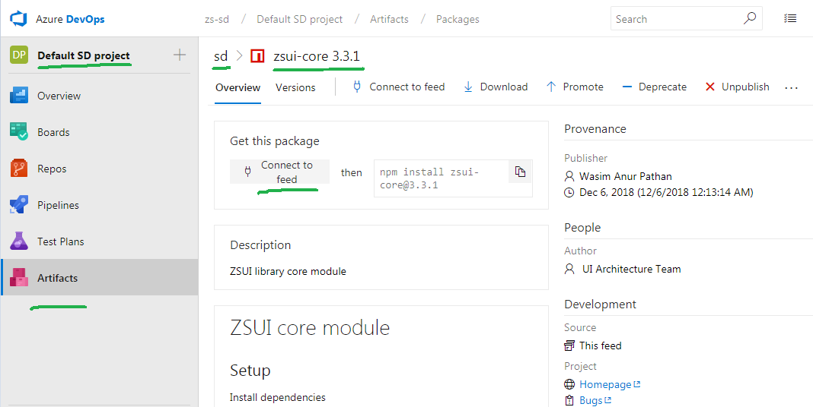
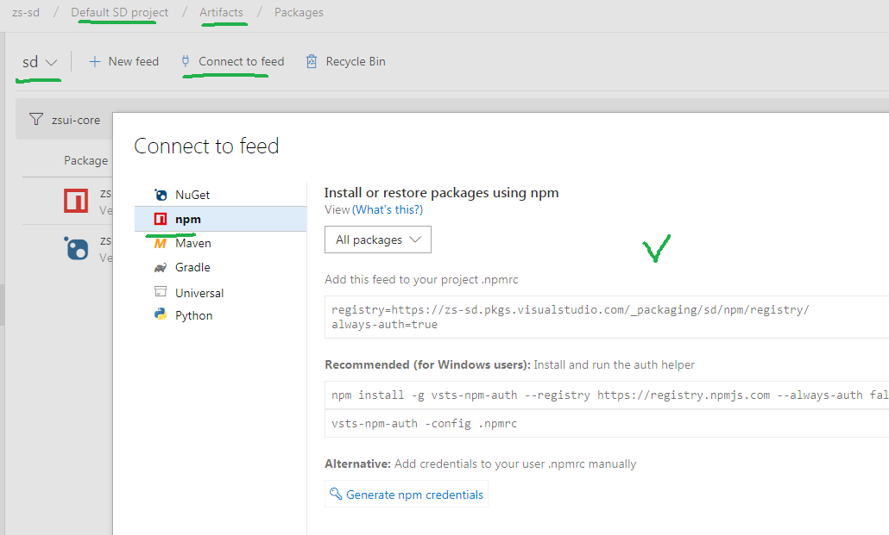

 

 


Teams often use package management solutions like **NPM** and **Nuget** in order to reduce maintenance costs of software development.

A typical software product would have dozens of dependencies. Each would require some regular work to check new versions, evaluate changes, download and install. Package management solutions help teams with that.

This document describes how we can securely publish and install SD assets across projects and teams.

# Azura DevOps 


> formerly known as Visual Studio Team Services

It is required to protect our software here in ZS. We cannot always share our assets publicly or through existing global services like nuget.org, npmjs.org. Microsoft Azure DevOps portal has a package management extension which we are going to use as a protected source for all ZS SD assets.

# How to connect?
In order to connect to our account [zs-sd.visualstudio.com](http://zs-sd.visualstudio.com/) developers should:

1.  Have a Visual Studio professional or enterprise [subscription](/groups/software-developers/blog/2015/10/28/msdn-subscriptions)
2.  Request an access to zs-sd.visualstudio.com Email to Rajendra Pataskar [rajendra.pataskar@zs.com](mailto:rajendra.pataskar@zs.com) and cc Val Mushinskiy [val.mushinskiy@zs.com](mailto:val.mushinskiy@zs.com)


# How to install a package?

Once you logged in, you will be assigned to a [Default SD Project](https://zs-sd.visualstudio.com/Default%20SD%20project).

[Goto artifacts](https://zs-sd.visualstudio.com/Default%20SD%20project/_packaging) in the menu of the project.

You should get in "sd" feed.


Find the package your are interested in. E.g. [zsui-core](https://zs-sd.visualstudio.com/Default%20SD%20project/_packaging?_a=package&feed=sd&package=zsui-core&protocolType=Npm)



Hit "connect" to join the feed and follow instructions


# How to publish a packages?

We encourage teams to create re-usable assets for user front-end and back-end and share with other teams.

You can publish unlimited number of NPM and Nuget package with reusable assets.

In order to publish a package [goto artifacts](https://zs-sd.visualstudio.com/Default%20SD%20project/_packaging).

Hit "Connect to feed" link and follow instructions for "NPM" or "Nuget".



Follow the instructions to authorize with our **sd** feed. 

Use command line to publish a package.

[Nuget](https://docs.microsoft.com/en-us/nuget/tools/cli-ref-push)
```shell
nuget.exe push -Source "sd" -ApiKey AzureDevOps my_package.nupkg
```

[NPM](https://docs.npmjs.com/cli/publish)
```
npm publish
```

We have two test packages for you to play. Try publish updates for this packages:

* [test-sd](https://zs-sd.visualstudio.com/Default%20SD%20project/_packaging?_a=package&feed=sd&package=test-sd&&protocolType=NuGet) Nuget
* [zssd-test](https://zs-sd.visualstudio.com/Default%20SD%20project/_packaging?_a=package&feed=sd&package=zssd-test&protocolType=Npm) NPM

# Upstream sources

Packages that cannot be served from the local feed will be retrieved from npmjs.com and cached in the feed.

If your package or project have “global” dependencies like jQuery you will be able to download it through our protected SD feed too.

You don’t need this for Nuget because in Visual Studio you can specify multiple sources. But in case of NPM your project usually has only one source of packages.